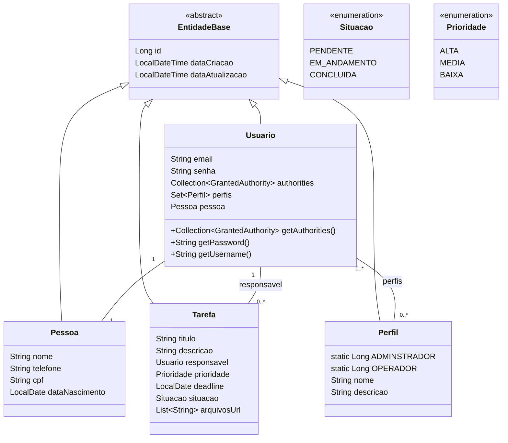

# API de Gestão de Tarefas
Este projeto é uma API para gestão de tarefas, desenvolvida utilizando Java, Spring Boot e Gradle. A API permite criar, atualizar, listar e concluir tarefas, além de outras funcionalidades relacionadas.

## 🛠 Tecnologias Utilizadas

### Backend
- **Java 21**.
- **Spring Boot (v3.4.2)**: Framework para criação de aplicações Java.
- **Spring Security (v6.1.4)**: Configuração de autenticação e autorização.
- **Spring Data JPA**: Manipulação de dados com JPA/Hibernate.
- **PostgreSQL (v42.3.1)**: Banco de dados relacional.
- **SpringDoc OpenAPI (v2.7.0)**: Documentação da API com Swagger.
- **ModelMapper (v3.0.0)**: Mapeamento de objetos DTO e entidades.
- **JSON Web Tokens (JWT) (v0.11.5)**: Gerenciamento de tokens para autenticação.
- **Lombok (v1.18.24)**: Redução de boilerplate no código.
- **Bean Validation** (Validação de dados).

### Testes
- **JUnit Platform (v1.8.2)**: Execução de testes unitários e de integração.
- **Spring Security Test**: Testes relacionados à segurança.
- **Spring Boot Starter Test**: Suporte para testes no Spring.

### Desenvolvimento
- **Spring Boot DevTools**: Ferramenta para facilitar o desenvolvimento.

## 🚀 Funcionalidades
## Funcionalidades

- **Criação de tarefas**.
- **Listagem de tarefas por responsável**
- **Conclusão de tarefas**
- **Listagem de todas as tarefas com paginação e filtros**
- **Contagem de tarefas por situação**
- **Listagem dos top 10 usuários com mais tarefas concluídas**
- **Segurança**: Implementação robusta com autenticação via JWT.



 

## ⚙️ Configuração

1. Configure o banco de dados no arquivo `application.properties`:
   ```properties
   spring.datasource.url=jdbc:mysql://localhost:3306/nome_do_banco
   spring.datasource.username=usuario
   spring.datasource.password=senha
   spring.jpa.hibernate.ddl-auto=update
## 📚 Uso das APIs

### Criar Tarefa
- **Endpoint**: `POST /tarefas`  

#### Exemplo de Requisição:
```http
GET /jornadas/1234/2024-12-20

#### Exemplo de Resposta:
```json
{
	"id": 5,
	"titulo": "TAREFA 1",
	"descricao": "DESCRICAO TAREFA 1",
	"responsavel": {
		"id": 1,
		"email": "sistema@sistema.com",
		"pessoa": {
			"id": 1,
			"nome": "Rodrigo Aguiar",
			"dataNascimento": "2025-02-06",
			"cpf": "33637830434",
			"telefone": "84987061013"
		},
		"perfis": [
			{
				"id": 1,
				"nome": "Adminstrador",
				"descricao": "PERIL DE ADM",
				"ativo": true
			}
		]
	},
	"prioridade": "ALTA",
	"deadline": "2025-02-19",
	"situacao": "PENDENTE"
}
